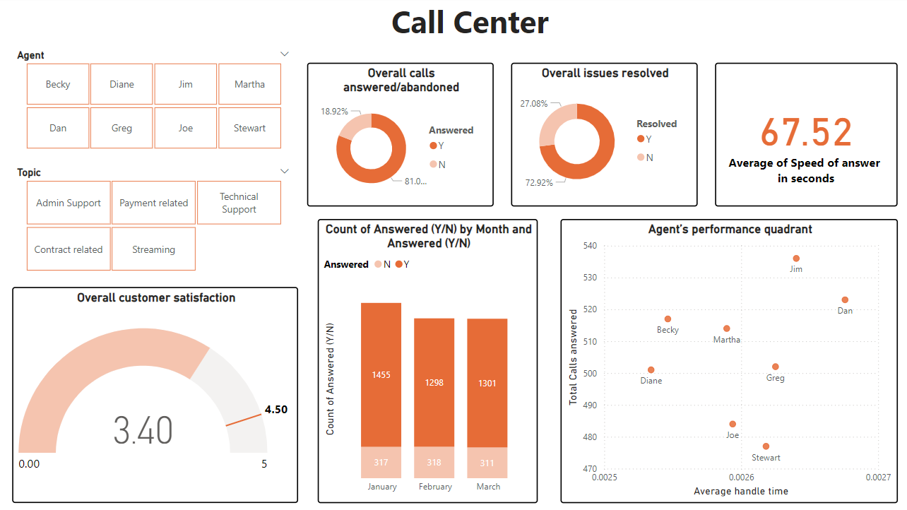
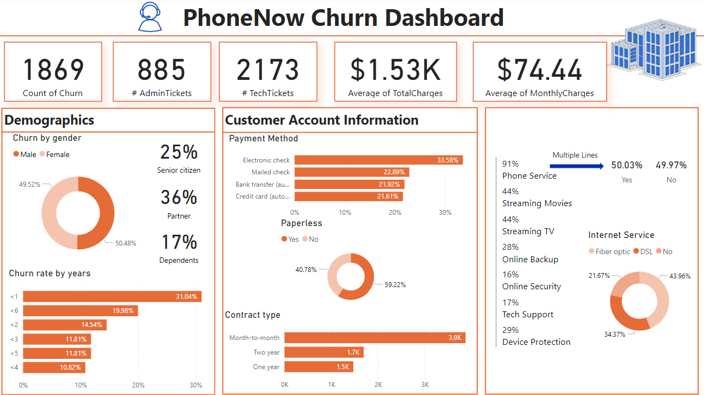
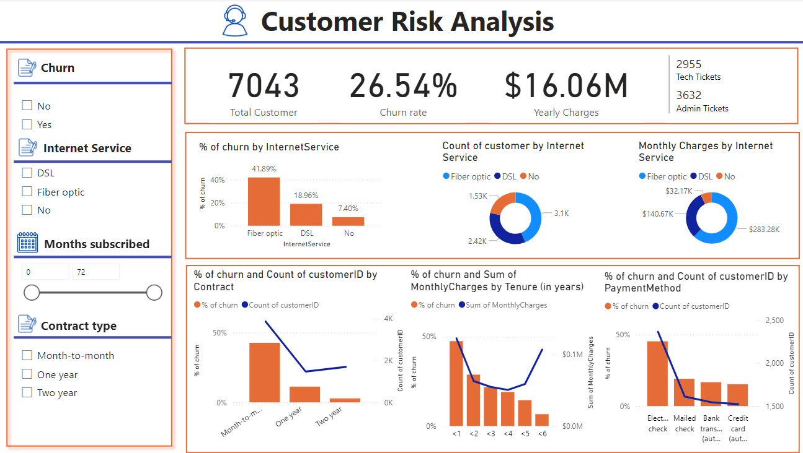
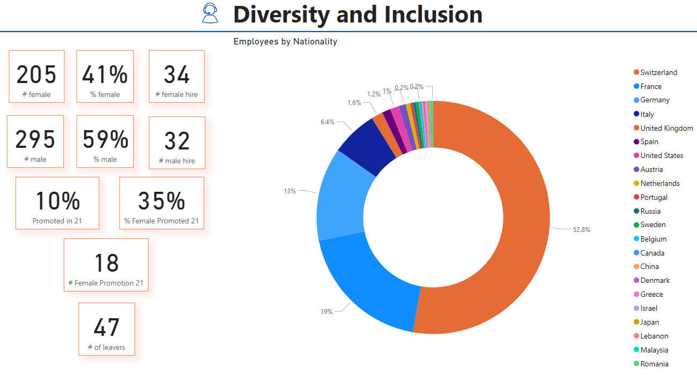
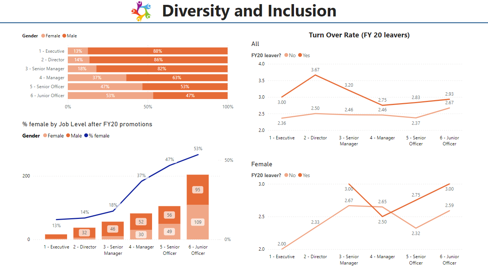
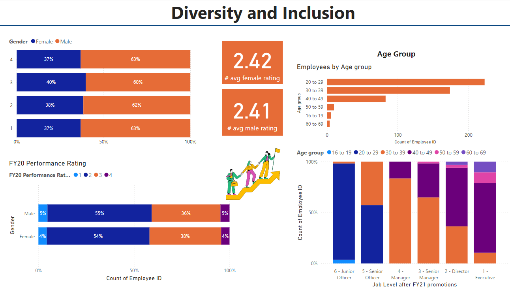

# PwC's PowerBI Virtual Internship at Forage

**My experience with PowerBI:** Nil  
**Number of tasks:** 4  
**Difficulty:** Moderate  
**Feelings when I started the first task:** Confused! :|

I discovered Forage about a year ago, probably through YouTube, and found it extremely useful. Though I had enrolled in some virtual job simulations, it wasn’t until a few months ago that I completed my first one—Product Design by Accenture.

Now, onto PowerBI. I realized that data is a powerful asset that can open many doors (and yes, it can also be quite lucrative!). Engineering colleges in India cover a lot of ground; the curriculum includes diverse subjects that build on each other. It was during my Computer Engineering course that I started working with data. From Data Structures to DBMS, DWH, Quantitative Analysis, and Applied Data Science, I initially disliked each subject until I actually studied it. Every time, I took one of these courses, I enjoyed working on the problem statements; yes, there definitely were those moments that made me wanna cry and I did. But this is what life is; you’ve gotta work to get something!

So, after all the years of engineering that I hated data and the brief time each semester that I loved it, I decided to make data my best friend! :) Over time, I realized that while courses are valuable, practical experience is unbeatable. And this is how the hunt for Data Science and Visualization virtual experiences began. 

## The Experience:
This virtual experience was very fruitful, as it helped me begin my data visualization journey. There were 4 tasks, each one honing my skills. The main focus was a hypothetical call center company, PhoneNow. We were given an Excel sheet with the necessary data to complete the tasks. 

**Task 1** was just a self-reflection activity to understand my expectations from the program and involved downloading and installing PowerBI on my system.

**The 2nd task** involved creating a dashboard for the call centre manager to help her understand KPIs such as (to get you started, but not limited to) - 
1.	Overall customer satisfaction
2.	Overall calls answered/abandoned
3.	Calls by time
4.	Average speed of answer
5.	Agent’s performance quadrant -> average handle time (talk duration) vs calls answered
Here’s the basic dashboard I created as an absolute beginner – 
 

Because this was the first time I was using this software, there was a lot for me to explore and this task did the work. This task helped me understand the power of different visualization tools and their capabilities.

**Task 3** was to create a dashboard for the Retention Manager of PhoneNow. This basically involved using tools like bar charts, pie charts etc. to understand the churn rate at the company and also the reasons why the churn occurs or customers leave the company. I came up with the following two pages of the dashboard for the problem statement.
 

**The 4th task** dealt with HR data to understand diversity, particularly focusing on gender-related KPIs. 
 

